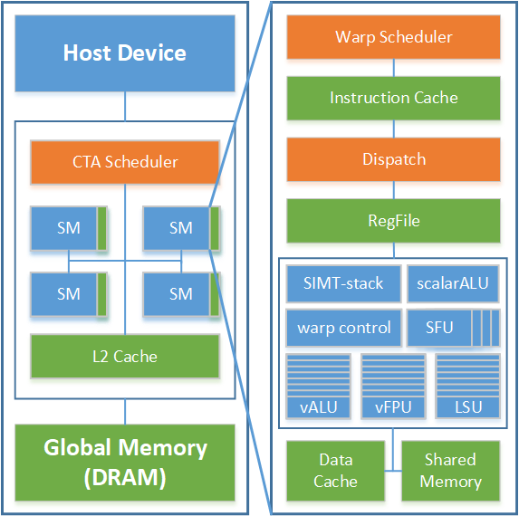

# Ventus(乘影) GPGPU

GPGPU processor supporting RISCV-V extension, developed with Chisel HDL.

Copyright 2021-2023 by International Innovation Center of Tsinghua University, Shanghai

We are calling for contributors. If you are interested in Ventus GPGPU, please contact yff22@mails.tsinghua.edu.cn

“乘影”在RVV编译器工具链、验证环境开发和硬件设计方面还有很多不足，如果您有意愿参与到“乘影”的开发中，欢迎在github上pull request，也欢迎联系 yff22@mails.tsinghua.edu.cn

乘影2.0架构文档在[这里](https://github.com/THU-DSP-LAB/ventus-gpgpu/blob/master/docs/乘影GPGPU架构文档手册v2.0.pdf)，添加了对OpenCL支持所需的改动。如果您在软硬件方面有任何建议，欢迎提issue或邮件联系。

乘影开源GPGPU项目网站：[opengpgpu.org.cn](https://opengpgpu.org.cn/)

Home page of Ventus-GPGPU project: [opengpgpu.org.cn](https://opengpgpu.org.cn/)

乘影软件工具链release版本在[这里](https://opengpgpu.org.cn/html/web/project/release/index.html)获取.

You can get the release version of software toolchain [here](https://opengpgpu.org.cn/html/web/project/release/index.html).

## Architecture

The micro-architecture overview of Ventus(乘影) is shown below.

ISA and micro-architecture docs is [here](https://github.com/THU-DSP-LAB/ventus-gpgpu/blob/master/docs/ventus%20GPGPU%20architecture%20whitepaper%20v2.0.pdf). Chinese docs is [here](https://github.com/THU-DSP-LAB/ventus-gpgpu/blob/master/docs/乘影GPGPU架构文档手册v2.0.pdf).

OpenCL C compiler based on LLVM is developed by Terapines([兆松科技](https://www.terapines.com/)).

Use the script in [ventus-llvm](https://github.com/THU-DSP-LAB/llvm-project) to configure the complete software toolchain, including [isa-simulator](https://github.com/THU-DSP-LAB/ventus-gpgpu-isa-simulator), [pocl](https://github.com/THU-DSP-LAB/pocl) and [driver](https://github.com/THU-DSP-LAB/pocl).



## Quick Start

[从零开始的配置教程](https://zhuanlan.zhihu.com/p/586445036)（中文，从WSL和IDEA安装讲起）

The tutorial of Chisel development environment configuration comes from [chipsalliance/playground: chipyard in mill :P](https://github.com/chipsalliance/playground)

0. Install dependencies and setup environments:

- Arch Linux  
`pacman -Syu --noconfirm make parallel wget cmake ninja mill dtc verilator git llvm clang lld protobuf antlr4 numactl`
- Nix  
`nix-shell`
- Ubuntu  

```shell
apt-get install make parallel wget cmake verilator git llvm clang lld protobuf-compiler antlr4 numactl
curl -L https://github.com/com-lihaoyi/mill/releases/download/0.10.8/0.10.8 > mill && chmod +x mill
```

> We recomment using java 17 or higher versions. **We test the project under java 19.**

1. Init and update dependences

```shell
make init
make patch
```

2. IDE support `make idea` or `make bsp # generate IDE bsp`

3. to generate verilog file, use `make verilog`. The output file is `GPGPU_top.v` . Notice that if you install 'mill' with 'curl', use `./mill` to replace `mill` in Makefile commands.

4. to run tests, use `make test`. Output waveform file is at `test_run_dir`  

> Notice that current codes are not stable and there are conflicts between existing codes and testcase `gaussian` `gemm`. We are preparing new testcase format to integrate with software toolchain and please wait for our new version.

### Understanding Program Output in Our Project

This section is dedicated to explaining the output generated by our program, which is crucial for developers who wish to understand the inner workings or debug the software. The output is structured to provide detailed insights into the program's execution, including instruction addresses, operations on warp units, and register manipulations.

#### Warp Execution Output

The program output is like:

```plain
warp 3 0x800001d4 0x0042a303 x 6 90000000
```

- **`warp 3`** identifies the warp unit in action, which start from 0.
- **`0x800001d4`** specifies the virtual address of the instruction being executed.
- **`0x0042a303`** represents the instruction itself.
- **`x 6 90000000`** signifies an operation where the program writes the value `90000000` to scalar register 6 of warp 3.

For a more complex example:

```plain
warp 2 0x80000200 0x0002a2fb v 5 0001 00000000 00000000 00000000 be8d0fac
```

- **`v 5 0001`** indicates an operation on vector register 5 of the second warp, where `0001` is a mask specifying that only the last thread is active.
- The data **`be8d0fac`** is written to the last element of the vector register due to the mask setting.

#### Jump Instructions

The output related to jump instructions follows this format:

```plain
warp 1 0x80000490 0x00008067 Jump? 1 800002f4
```

- **`Jump? 1 800002f4`** indicates a conditional jump to the address `0x800002f4` depending on the evaluation of the preceding condition.

#### Load/Store Instructions

Load and store operations are crucial for reading from and writing to memory:

```plain
warp 2 0x80000200 0x0002a2fb lsu.r v 5 op 3 @ 00000000 bdcccccd 3e54ad4b 90002038
warp 2 0x80000200 0x0002a2fb v  5 0001 00000000 00000000 00000000 be8d0fac
```

- **`lsu.r`** specifies a load operation from memory into a register.
- **`@ 90002038`** marks the memory addresses from which data is loaded.
- **`v  5 0001 00000000 00000000 00000000 be8d0fac`** represents the data is loaded,  and only the last element of v[5] is set to `be8d0fac` due to the mask (and apparently only `90002038` is a valid address).

For write operations:

```plain
warp 2 0x80000240 0x0052607b lsu.w v  5 op 3 mask 0001 00000000 bdcccccd 3e54ad4b 3f0e5e0a @ 00000000 90000034 90000038 9000003c
warp 2 0x80000240 0x0052607b lsu.w fin
```

#### Branching Output

Branch-related outputs are essential for SIMT arch support. Example:

```plain
warp 3 0x80000248 0x0483305b  setrpc 0x8000028c
warp 3 0x8000024c 0x0401905b vbranch     current mask and npc:   0001    0x80000250
warp 3 0x8000028c 0x0000205b join    mask and npc:    1110 0x8000028c pop stack ? 1
```

## Acknowledgement

We refer to some open-source design when developing Ventus GPGPU.

| Sub module    | Source                                                                               | Detail                                                                             |
| ------------- | ------------------------------------------------------------------------------------ | ---------------------------------------------------------------------------------- |
| CTA scheduler | [MIAOW](https://github.com/VerticalResearchGroup/miaow)                              | Our CTA scheduler module is based on MiaoW ultra-threads dispatcher.               |
| L2Cache       | [block-inclusivecache-sifive](https://github.com/sifive/block-inclusivecache-sifive) | Our L2Cache design is inspired by Sifive's block-inclusivecache                    |
| Multiplier    | [XiangShan](https://github.com/OpenXiangShan/XiangShan)                              | We reused Array Multiplier in XiangShan. FPU design is also inspired by XiangShan. |
| Config, ...   | [rocket-chip](https://github.com/chipsalliance/rocket-chip)                          | Some modules are sourced from RocketChip                                           |
