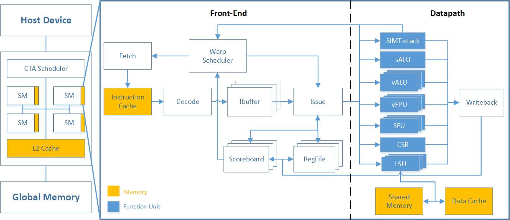

# Ventus（承影）：基于RVV的开源GPGPU
清华大学集成电路学院dsp-lab的承影RVV GPGPU设计文档。
## 整体目标
提供一个开源的基于RVV的GPGPU实现方案，并给出软件映射方案、指令集（支持的指令及特性、添加的自定义指令）和微架构实现

## 软件任务调度及CTA实现方案
### 软件模型
无论采用何种指令集及微架构，GPU的编程模型是一样的。最基本的编程行为是，CPU（host）在特定的上下文（context）中，将对应的数据放入GPU内存，然后在GPU端唤起一个任务（kernel），GPU接收任务并执行，执行完成后将结果写回GPU内存，并返回CPU一个完成信号，CPU将数据搬回。
这个任务（kernel）在软件层面是按照grid、block、thread的层级下分的，每个kernel有一个grid，下面有若干个block，每个block有若干个warp。程序员对单个数据的操作抽象为一个thread，它是GPU的基本编程单位，程序员通过描述对一个thread的操作，并指定需要并行执行的block数、thread数，来完成并行编程的任务。

### CTA任务分配
在硬件层面，将按照32个thread组成一个warp的形式，作为整体在SM硬件上进行调度。同一个block的warp只能在同一个SM上运行，但是同一SM可以可以容纳来自不同block甚至不同grid的若干个warp。
CPU发送给GPU的任务以block为基本单位，在我们的硬件上，block是单个任务单元，将由CTA scheduler接收，CTA scheduler会按block中包含的总warp数信息，以及需要占用的寄存器、local memory、sharedmemory大小，将block对应分配到空闲（即剩余资源足够）的SM上。（注意在rv架构下没做寄存器映射，因此默认分配32个标量寄存器和32个向量寄存器，下文有说明）
CTA scheduler以warp为单位逐个发送给SM，同一block的warp会分配到同一SM中，warp_slot_id的低位即表明了该warp在当前block中的id，高位表明了block所属的id。相应的，SM会通过此id，计算出当前warp在所属block中的位置，并将该值置于CSR寄存器中，供软件使用。分配的sharedmem baseaddr，global baseaddr，pc start，也是通过CSR读取的。 

| name | addr | description |
| --- | --- | --- |
| CSR_NUMW | 0x801 | 该block中的warp总数
| CSR_NUMT | 0x802 | 一个warp中的thread总数
| CSR_TID  | 0x800 | 该warp对应的thread id，是NUMT的倍数
| CSR_WID  | 0x805 | 该block中本warp对应的warp id
| CSR_GDS  | 0x807 | global memory的baseaddr ，在纯仿真中是shared memory的最大值
| CSR_LDS  | 0x806 | 该block分配的shared memory的baseaddr

### 汇编编程说明
目前我们没有配套的编译器，为实现针对上述硬件行为的额外操作，在汇编中需要手动插入这些指令：
1. 需要通过 vid.v 与 csrrs CSR_TID 相加来获得thread各自的id
2. 访存时预先读取 CSR_GDS和CSR_LDS作为数据基址
3. 自定义指令的使用：
	1. predicate：我们在支持RVV定义的软件控制mask的同时，也支持用自定义指令来启动隐式的硬件predicate，详见自定义指令一节。
	2. warp运行结束时需要显式使用endprg指令。
	3. 同步目前仅支持同一block内warp间的全局同步。

其余行为与RVV编程一致。
对于超过单组硬件处理能力长度的向量数据，支持使用RVV中定义的stripmining方式执行，默认单次处理num_thread个数据。与向量处理器不同的是，这时可以用SIMT-stack而非软件mask来实现，也可以在block大小允许时拆分为更多warp去调度。

以gaussian消元为例，将Ax=b中的A变为上三角矩阵：
软件人员编程时，矩阵的每个元素都是预期以行为单位组织thread，计算时不同的行计算系数，相乘并减去，逐行处理完所有比自己行号小的行。循环的次数、相乘的位置由thread id决定。

## 指令集架构
### RVV与GPGPU的结合
《量化研究方法》中提到了向量处理单元与多线程GPU在SIMD层面上的工作形式十分相似，向量处理器的车道与多线程SIMD的线程是相似的。区别在于通常GPGPU的硬件单元更多，chime（钟鸣）更短，向量处理器通过深度流水线化的访问来隐藏延迟，GPGPU则是通过同时多warp切换来隐藏延迟。因此在向量层面的操作上，RVV足以覆盖住GPGPU中的操作。此外，形如AMD和turing后的NV，提供了标量ALU，也是借鉴了向量处理器的方式。
因此，在RVV的基础上添加自定义的分支控制指令、线程同步指令、线程控制指令，就能实现GPGPU的功能。
为了最大限度的保留对RVV开源工具链的兼容性，我们对RVV中的大部分指令都进行了支持。少数不支持的指令包括：1. 涉及线程间数据交换的shuffle等指令，在GPGPU中线程间通常是独立操作，数据依赖需要用atomic或barrier显式操作 2. 向量寄存器长度和宽度变化的指令，GPGPU中几乎不会触及（少有的几条向量或者量化相关的功能会需要类似的功能） 3. 64bit相关的指令，在后续版本将支持。

在RVV的stripmining基础上添加warp级别并行，或许能在更优尺度上裁剪向量/SIMT指令，探索任务划分和调度空间。

### 寄存器设计

承影当前的寄存器堆实现方案为：单个SM上能同时承载的最大warp数为num_warp，每个warp由num_thread个线程组成。每个warp都有一套自己的寄存器，包括32个标量寄存器和32个向量寄存器，每个标量寄存器的宽度为32bit，每个向量寄存器的宽度为32\*num_thread，并归属于各个thread私有。
虽然所用指令形式和意义相同，但区别于RVV，GPGPU中并不支持向量寄存器的长度和数量变化（长度固定为32bit，数量固定为num_thread），因此对于vsetvl系列指令，只有返回的剩余元素数量是有效的。
考虑到寄存器的实际使用，未额外规定浮点寄存器，需采用与zfinx扩展相同的方式管理。此外，由于长度为32bit，也不支持double相关的指令，以及64位相关的指令（即不支持rv64中wordlength=64bit的指令）。考虑到目前的RVV工具链多是以rv64gc构建的，且统一地址空间中4G可能不够使用，后续版本会考虑采用64bit的寄存器并支持更多指令。

### 地址映射
GPGPU中的物理地址空间包括sharedmem和globalmem，在PTX中每个地址都带有属性声明了其类型。
但在RV中没有该字段，加上目前没有设计MMU（后续将考虑），因此承影目前的方案是用地址范围来区分sharedmem和globalmem。
所有SM共用一个4GB的全局地址空间，其中地址为0-128kB的字段将被映射到SM内部各自的sharedmem上，从global_baseaddr到4G的空间则映射到同一块ddr的相同地址上（即该部分使用物理地址）。而ddr中0-global_baseaddr的部分仅可以通过icache访问，可用于储存指令。
目前同步仅支持block内warp间同步，通过barrier实现。

### 支持的指令
目前承影支持RVV中的指令包括以下类型：
1. 计算类，包括整数运算（加减、比较、移位、位运算、乘、乘加、除）、单精度浮点运算（加减、乘、乘加、除、整型转换、比较），支持带mask执行
2. 访存类，包括三种访存模式，以及byte级读写，支持带mask执行
3. mask类，包括比较及逻辑运算，但不包括vmsbf等涉及thread间通信的指令，也不支持gather等操作
对于改变向量位宽的指令暂不支持，但vsetl系列指令可以返回vl供stripmining使用。
RV32I中支持除ecall ebreak外的指令。由于目前没设计MMU，仅支持机器模式。
M F中支持32bit相关指令。

目前的自定义指令包括：
1. predicate：我们在支持RVV定义的软件控制mask的同时，也支持用自定义指令来启动隐式的硬件predicate。启动的方式是使用自定义的vbeq系列线程分支指令，该指令会启动一个split，计算出当前分支的mask情形，并将else对应的mask压入SIMT-stack，然后带有mask执行if段，待if段末尾遇到join后再将else段及其对应mask出栈，待if段执行完成后合并恢复mask，分支结束。该过程可以嵌套。此外，如果分支计算出全走其中一条，将不会压栈并跳过另一条分支，带有branch divergence的for循环也可以用此机制实现。
2. barrier：用该指令可以实现warp间的同步，每个遇到该barrier指令的warp都会等待，直到该block中所有未结束的warp都遇到此指令才会再次继续。
3. endprg：warp运行结束时需要显式使用endprg指令。
4. （计划中）warpgen：为支持动态并行，需要添加一个在gpu端唤醒warp的指令。

## 微架构设计
### CTA-scheduler

参考miaow的版本进行设计。CTA-scheduler记录了每个SM中寄存器和sharedmemory的使用情况，根据host发送的CTA信息，将CTA分配给剩余资源足够的SM并以warp为单位发送到SM上。整体结构由host-interface、pending-workgroup table、allocator、resource table、GPU interface组成，由Controller统一控制。

### L1 cache

#### L1 向量数据缓存

写穿通，写不分配。非阻塞式cache，使用静态MSHR管理in-flight miss。向L2写回数据时对齐word。目前bank数量与流水线车道数量保持一致，未来支持可配置任意2的幂次。LSU发起的请求必须coalesce，即向量所有元素集中在一个cache line。使用多bank SRAM支持向量数据读写，两个所访问元素位于同一个SRAM bank时称为bank冲突。使用仲裁机制把请求分摊到多个周期返回。

#### 指令缓存

只读标量缓存。非阻塞式cache（以支持大量warp的交替工作），使用类似的静态MSHR管理miss。

### L2 cache

参考sifive的block-inclusive-cache进行设计。为便于观察写入结果，目前L2cache采用了write through策略。

### SM(streaming multiprocessor)

SM内部总体分为前端和后端，前端包括了取指、译码、指令缓冲、寄存器堆、发射、记分板、warp调度，后端包括了ALU、vALU、vFPU、LSU、SFU、CSR、SIMT-stack、warp控制等。涉及寄存器连接的模块间均采用握手机制传递信号。

#### warp调度
warp调度器主要的功能包括：
1. 接收CTA调度器提供的warp的信息，分配warp所属的硬件单元并预设CSR寄存器值，激活该warp并标记所属的block信息。在warp执行完成后，将该信息返回给CTA调度器并释放对应硬件。
2. 接收流水线发送的barrier指令信息，将指定的warp锁住直到其所属的block的所有活跃warp到达此barrier。
3. 选择发给icache的warp，通常采用贪婪的策略，但当icache发生miss，或ibuffer已满时会将该warp的pc回退并切换到下一个warp发射。
4. 选择发给执行单元的warp，通常采用轮询的策略，选择出当前指令缓冲有效、记分板未显示冲突、执行单元空闲的指令。切换warp仅需要一个周期。

#### 取指
每个warp存储各自的pc，被选中送入icache的pc会+4，其余保留原值，遇到跳转时则替换为目标地址。
#### 译码
icache命中的指令进行译码，译码器根据指令内容转换出对应的控制信号，并送入对应的指令缓冲中。
#### 指令缓冲
指令缓冲是一系列的FIFO，每个warp有各自的ibuffer，接收译码后的输入并等待选中发射。
#### 寄存器堆
不同于gpu中的设计，由于rv中指定了需要32个寄存器，因此目前的寄存器按照warp进行了分区，每个区域都是32个标量寄存器加32个向量寄存器。
标量寄存器提供至多三个读端口（乘加指令的三个操作数）与一个写端口（采用复制三份的单端口读写寄存器实现），向量寄存器提供至多四个读端口（三个源操作数与一个mask）与一个写端口，支持带mask的写入。
按照warp分区、单指令至多读4个寄存器也确保了读数时不会发生bank conflict。

#### 发射
发射仲裁由warp调度器进行，被选中的控制信号与源操作数一起，依据识别其所需运算单元的类型，发送到对应运算单元执行。SIMT-stack相关指令需要同时用到vALU和SIMT-stack两个执行单元。
#### 记分板
每个warp有各自的记分板，当一条指令发射成功后，所写入的寄存器将被记分板标记，下一条指令若会读写已被标记的寄存器，则不允许发射，直到指令执行完成记分板释放对应寄存器。
分支、线程分歧、跳转、barrier指令也会被锁住，只有这些指令完成判断且能继续顺序执行时才会释放。执行barrier期间，会同时清空除ibuffer外的流水线（属于该warp的部分）；若发生跳转，会同时清空所有流水线（属于该warp的部分），此后记分板解除锁定。
#### 写回
各个运算单元在输出级均有FIFO，等待写回寄存器的结果暂存在其中，由Arbiter选中后写回寄存器。写回标量寄存器与向量寄存器是完全独立的数据通路。
#### ALU
ALU中进行标量运算，包括warp间共用的数据，以及跳转控制等。
#### vALU
是单个ALU的复制，是核心的整型运算单元，供warp的多线程车道进行运算。目前一个周期完成一次请求，后续版本会修改功能单元数目，并采用与SFU相似的方式多周期执行。
#### vFPU
是核心的浮点运算单元，供warp的多线程车道进行运算。标量浮点运算也在此进行。
#### MUL
乘法运算单元，2个周期完成32bit乘法。
#### LSU
是核心的访存单元，会根据地址范围判断将读写请求发送给sharedmem或dcache（再由L1 dcache访问L2cache，再访问ddr即globalmemory）。
LSU中有MSHR形式的结构，可以一次存储和记录多个LSU请求，也会收集dcache和sharedmem返回的数据，集齐后再返回给流水线。
LSU中会完成strided及索引模式下向量地址的计算，并根据地址范围以cacheline为单位进行合并访问。最理想的情况（指地址连续且对齐cacheline）下一次访存即可取出单个warp所需结果。
bank conflict由sharedmem和dcache自行处理。
在LSU中还会记录现有的访存请求信息，以实现fence指令。当遇到该指令后，会让所属warp的所有访存请求处理完成（读数据返回数据，写数据返回写响应）后再发送新的访存请求。

#### CSR
在warp启动时，对应的CSR会设置好应用程序所需的一些值，包括thread id等。
vsetl也在此计算。其余与CSR的功能一致。

#### SFU
区别于PTX中提供的sin cos等函数，目前的SFU只支持了rv定义的整数除法取余、浮点除法、浮点平方根功能。
本身运算就需要多周期完成，加上SFU中的运算单元数量少于lane数，因此如果未mask的线程较多时，chime会更长。

#### warp控制
barrier、endprg会发送给warp调度器处理。
后续会考虑支持动态并行，添加warpgen指令。

#### SIMT-stack
SIMT stack的主要功能如下：维护分支嵌套控制流，保障程序运行的正确性；在实际没有分支分歧发生时，跳过不必要程序段的执行。
由SIMT-stack设置的隐式mask会在该warp执行过程中一直生效，直到有其它分支管理支持对其进行修改。该mask与RVV软件形式的mask可以叠加生效。
与分支管理相关的自定义扩展指令集有上表所示7条，其中1-6条为分支指令。以vbeq指令为例，需要完成的功能为：取源操作数vs2与vs1，valu模块对这两个向量寄存器中的元素一一进行比较，对于第i个元素，若vs2\[i\]=vs1\[i\]，则计算结果out\[i\]为1，最终valu的输出结果out为分支指令对应的else路径掩码，同时译码模块将向分支管理模块发送分支发生标记以及else路径PC起始值PC branch。
整体微架构方案如图所示。

