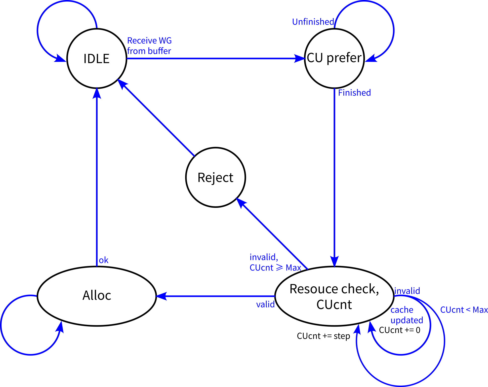

# Allocator

> 缩写词：Resouce Table = RT

# 整体功能

Allocator的功能：决定将线程块分配到哪一个能容纳它的CU上（或拒绝分配），也就是将如下两项相互独立功能的结果综合起来

* 功能1：CU优先级抉择
* 功能2：CU资源可容纳判定

本实现先判定CU优先级，再自最高优先级起逐个CU做资源判定，直到找到一个能够容纳的CU，完成分配，状态机图如下：

1. 在ResouceCheck状态，从最高优先级的CU起，每周期判定`step`​个CU是否能够容纳此线程块，直到找到一个能容纳的CU或发现所有CU均不能容纳为止

    * 若某个CU被判定无法容纳，但同时此CU的RTcache被更新，说明发生了新的dealloc，可以重新判定。
    * 即使原先已经判定可以容纳，也需要重新判定一次，因为之后alloc改写RTcache时需要作为判定副产物的RTcache表项地址
2. 在Alloc状态，完成以下几项内容：

    * 向CU interface发送线程块信息
    * 更新RTcache内容
    * 向Resouce table发出alloc请求以求取BaseAddr并改写资源表
3. 在Alloc状态必须关注维护RTcache内容的有效性

    * 本状态在Resource Table接收alloc请求前，禁止alloc目标CU的RTcache被更新(ready=false)，因为新的alloc请求即将发出，此时RT给出的结果已经失效
    * Resouce table接收到一个alloc请求后，必须立即清空此CU已经或正在生成的RT result，因为它们已经失效
    * 事实上RTcache写锁定应当从RTcache被读取的第一个周期开始，但RecouceCheck状态有重读功能，规避了此问题

# Resouce table cache

Allocator中存在Resource table cache（RTcache)，储存着Resource table找到的空闲资源片段大小size

* Allocator只利用RTcache做容纳性判定，即使这可能与实际情况不完全相符
* RTcache中每项具有~~valid位~~与size字段。只要某项是valid的，就应当且能够保证CU中至少存在一个大小≥size的空闲资源片段

  * 更新：Valid字段不必要，将对应Size字段置零效果相同
  * 在一次alloc后将size扣除被alloc的值即可，其内容仍然有效
  * 将Size字段的语义设置为“大于等于”，而不是原有实现中的“等于”，优势如下：

    * 使Size字段的有效时间大大延长。若设置为等于，任何dealloc都将使得所有Size记录完全失效，暂时剥夺此CU参与资源判定的资格。而剥夺高优先级CU的判定资格将可能使GPU整体性能下降
* RTcache中可能存有多项 ~~，每项都代表一个独立的空闲资源片段~~，向一个片段alloc不影响另一个片段的valid性

  * 可以保证刚刚cache update时，各项所代表的空闲资源片段是独立的（由resouce table保证）
  * 无法保证一段时间后多项之间的独立性：因为dealloc可以将两段本独立的资源片段融合为一段
  * 但仍可以保证向一个片段alloc不影响另一个片段的valid性：

    * 若两个片段已经或即将被融合成一个片段，则新片段大小size > size0 + size1，即使扣除全部size0，也仍能保证size ≥ size1
* 由于Resource table处理数据缓慢，RTcache无法时刻持有真实数据

  * RTcache设计目标：任何时候保证资源不超量分配
  * RTcache与实际情况同步时（上次更新RTcache后此CU再未有alloc/dealloc行为），RTcache的容纳性判定结果与实际完全一致  
    因为此时RTcache中必定存有最大空闲资源片段的大小
  * RTcache与实际情况不同步时（此CU的RT有正在处理的alloc/dealloc还未更新RTcache），RTcache只能保证不超量分配资源  
    此时RTcache中的数据可以理解为对实际情况的最坏预估
  * 可以增加RTcache中的记录项数以使RTcache的最坏预估更加贴合实际情况，从而使Allocator的容纳性判定更贴合实际情况
  * 在alloc/dealloc不频繁的情况下，大多数时候RTcache的数据能够与实际情况同步
  * > 原有实现中在RTcache无法同步实际情况时直接剥夺此CU的容纳性判定资格，而不是在保证不超量分配的前提下对实际情况做估计
    >
* Allocator按照固定优先级来使用RTcache中的项：第0项优先级最低，resouce table应当将更大的资源片段放置在低位
* Allocator假定将WG分配到它选定的资源片段，只因这是Allocator视角的最坏预估，但实际并不总是如此

  * BaseAddr采用Lazy求值的方式，在确定将线程块分配到CUx上后再由CUx的Resouce table来求取一个BaseAddr
  * RT求取BaseAddr时会选取一个能容纳此线程块的最小片段，而不总是使用最大片段，这样更好地防止资源碎片化
  * 示例：某CU的RTcache中缓存了size0=5, size1=3  
    现有一线程块要求资源量为2，由于size1=3表明有一片大小至少为3的片段，一定可以容纳，allocator决定将线程块分配到此CU上  
    allocator假定此线程块分配到大小至少为3的片段上，更新size1=1  
    RT开始求取BaseAddr，若最终将线程块分配到size1对应片段，则语义正确；  
    若最终将线程块分配到了其他更合适的片段，则3>size1=1，语义正确。

​​

在原有实现中，RTcache中缓存了资源片段的BaseAddr，并将其作为最终分配线程块的BaseAddr。这项功能被移除的原因：

* 原有实现RTcache中Size字段的语义是最大资源片段的大小（不是大于等于），BaseAddr字段的语义是最大资源片段的首地址
* 新实现中cache中不保存BaseAddr并用作WG资源基地址的原因

  * RT可以在任意空闲时刻接收dealloc请求，但是并不能即使更新RTcache（需要扫描链表来生成结果）
  * 如果将BaseAddr字段定义为片段首地址，则一旦有dealloc请求则此CU的RTcache立即失效，必须等待

    * 可能更优的方式：对BaseAddr采用Lazy求值的思想，在确定将线程块分配到CUx上后再由CUx的Resouce table来求取一个BaseAddr
  * 如果将BaseAddr字段定义为保证Size字段有效的一个片段中的任意地址，则会在将线程块alloc到资源片段中间，造成资源碎片化，不可接受
* 新实现中BaseAddr字段Lazy求值的优劣

  * 在dealloc很频繁时，Lazy求值将多次RT扫描合并为1次，吞吐量上升（优势）
  * 否则，Lazy求值将使Allocator处理一个线程块的耗时增加，吞吐量下降（劣势）
  * Lazy求值能够得到更优的BaseAddr：选取一个能容纳线程块的最小片段，而不总是使用最大片段，更好地防止资源碎片化（决定性的优势)
  * 通常来说，alloc与dealloc都是极不频繁的操作，Allocator吞吐量下降可能是很小的代价，而防止资源碎片化能够优化GPU整体性能
