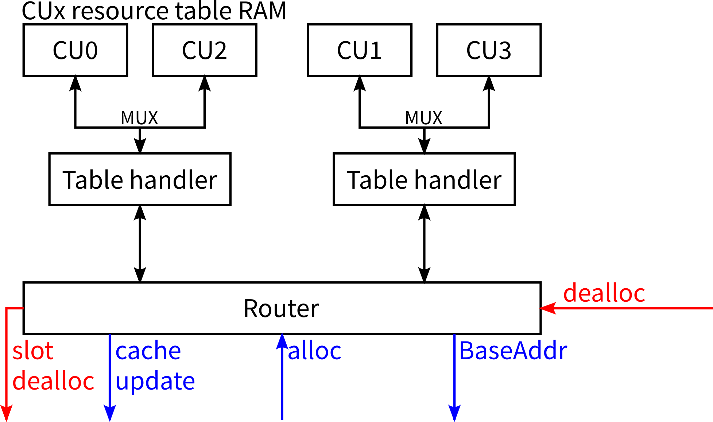
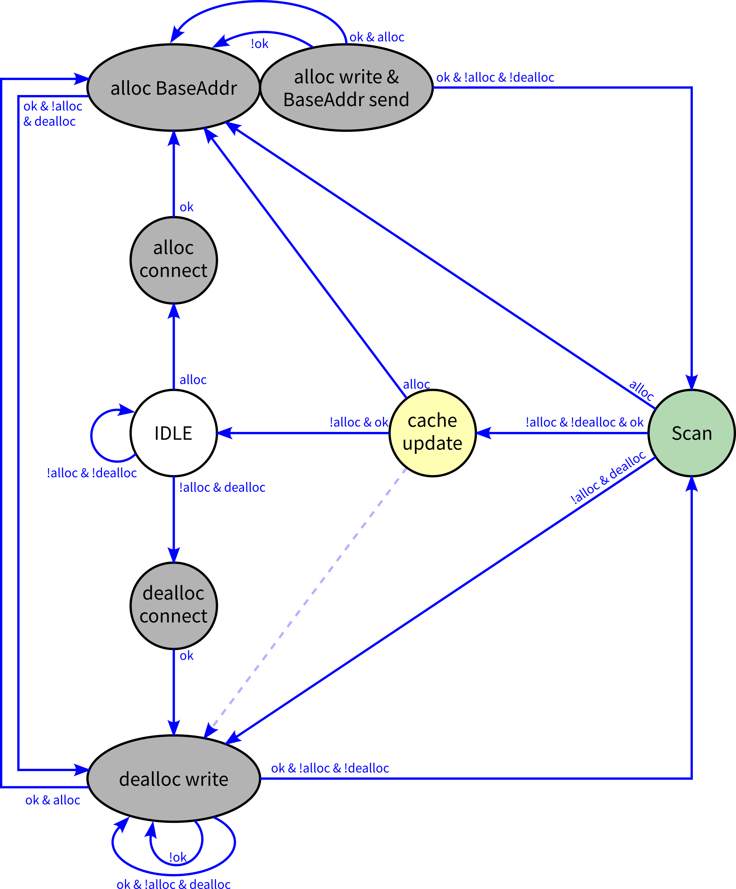
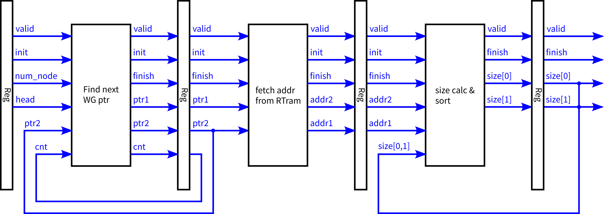
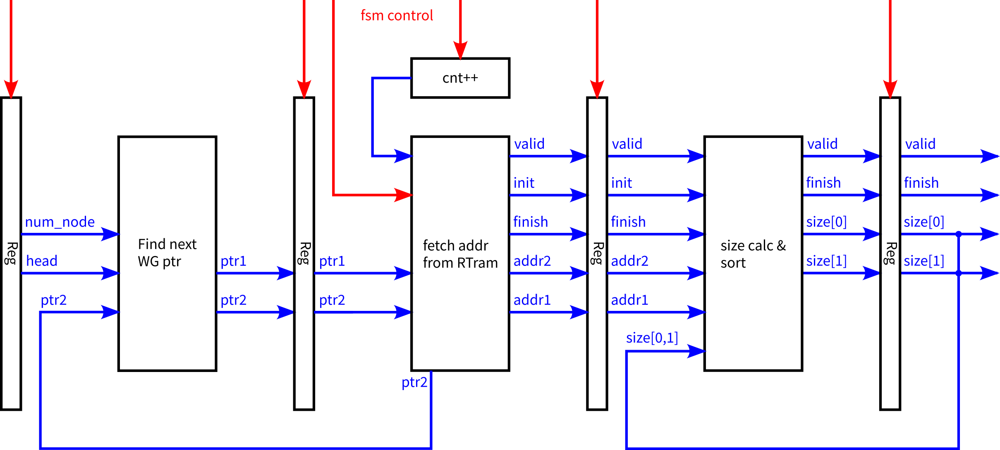

# Resouce table

> 缩写词：Resouce Table = RT

# 整体概述

Resouce table模块的硬件结构图如右

1. 每项资源（LDS/sGPR/vGPR）独立拥有一整套右图所示Resource table

    * 在实际代码中，部分Router逻辑是公用的，但Router路径是每种资源独享的
2. 每个CU拥有一个独立的RT RAM用于记录资源使用情况，RAM长度`NUM_WG_SLOT_PER_CU`​

    * 各WG的资源占用信息写入到`RAM[WG_SLOT_ID]`​，资源释放时也按照`WG_SLOT_ID`​快速寻址
    * 每个RAM项分为4个字段：资源占用首地址、尾地址、双向链表指针`slotid_prev`​、`slotid_next`​
    * 双向链表按照资源占用地址从低到高的顺序串联各WG信息
    * ALLOC请求：遍历链表找到合适的BaseAddr、在`RAM[WG_SLOT_ID]`​处写入首尾地址、将此项插入链表
    * DEALLOC请求：直接找到`RAM[WG_SLOT_ID]`​项，将其链表前后项彼此连接以删除此项
3. 由于alloc与dealloc请求并不频繁，多个CU的RTram可以共享一套处理逻辑（Table Handler）

    * 这种主从多对多的对应关系都可以分为：直接映射、全相连、组相连。目前先采用直接映射。
    * Handler及其对应的CU RTram作为硬件上连接的整体，在代码中称为一个group
    * Handler与RTram之间的Mux在当前直接映射、CU较少的情况下只是简单的组合逻辑  
      未来若升级到组相连或CU较多时，纯组合逻辑也许会存在时序不满足的情况，可能添加额外的时序逻辑控制  
      在主状态机中留置Connect状态来为未来升级做准备
    * Table handler与CUx RTram的对应关系可能按照cu_id的反比特序较好

​​

输入输出（全部为DecoupledIO）与数据处理

* 收到alloc请求：对应的Table handler遍历链表寻找合适的BaseAddr，写入RTram，发送BaseAddr。激活scan。
* 收到dealloc请求：对应的Table handler删除链表项，激活scan。将WG/WF slot的dealloc请求转发给Allocator
* BaseAddr输出接口：一个Table handler处理完一个alloc请求后发出一个BaseAddr
* cache update输出接口：一个Table handler完成一次链表scan后更新Allocator中的RTcache
* 激活scan ≠ scan将完成并更新RTcache，因为scan可以被alloc或dealloc请求抢占

来自Top的要求

* Resouce Table收到CUx的Alloc请求后

  * 立即清除CUx已生成的RT result
  * 立即放弃CUx正在生成的RT result
* 整个Resouce Table（所有CU）在同一时刻只能处理同一个alloc请求

  * 因为从alloc到BaseAddr的路径不是顺序（先入者先出）的，如此才能保证CU interface接收到的三路信息属于同一个线程块（其他两路是顺序的）
  * 可以在Router中监视alloc请求的进入与完成（`alloc.fire`​与`BaseAddr.fire`​），存在一个正在处理的alloc请求时强制`alloc.ready = false`​
* cache update输出内容要求：给出几段互相独立的空闲资源片段大小

  * 最低位给出的片段在Allocator中优先级最低（推荐为最大片段）

# Resouce table RAM

每个CU拥有一个独立的RT RAM用于记录资源使用情况，RAM长度`NUM_WG_SLOT_PER_CU`​

* 各WG的资源占用信息写入到`RAM[WG_SLOT_ID]`​，资源释放时也按照`WG_SLOT_ID`​快速寻址
* 每个RAM项分为4个字段：资源占用首地址、尾地址、双向链表指针`slotid_prev`​、`slotid_next`​
* 双向链表按照资源占用地址从低到高的顺序串联各WG信息
* ALLOC请求：遍历链表找到合适的BaseAddr、在`RAM[WG_SLOT_ID]`​处写入首尾地址、将此项插入链表
* DEALLOC请求：直接找到`RAM[WG_SLOT_ID]`​项，将其链表前后项彼此连接以删除此项

除此之外每个CU的RTram还有一套链表相关的数据：

* ​`head`​：链表第一项的WG_SLOT_ID，若链表空则其值为DON'T CARE
* ​`tail`​：链表最末项的WG_SLOT_ID，若链表空则其值为DON'T CARE
* ​`count`​：链表中记录的WG个数

# Router

## 功能1：转发alloc与dealloc请求

依据alloc与dealloc两个DecoupledIO中传递的CU ID信息来接通对应的Table handler。

在空闲时刻应当输出ready置0，而不能连接到任意table handler

alloc与dealloc各有一套独立的Router路径，互不干扰

注意：Router禁止缓存alloc请求，禁止缓存RT result，因为alloc请求一旦接收就必须表明对应CU的RT result已经全部清空

如果Router用于仲裁请求的组合逻辑链路过长，可以使用状态机拆分为多周期，但从alloc/dealloc请求到Table handler之间仅能有一层MUX

三种资源RT router可以共享仲裁逻辑，因为对于alloc与dealloc总是同时面向三种资源

## 功能2：转发BaseAddr

将BaseAddr端口valid = true的Table handler的BaseAddr端口连接到输出端即可

需要将三种资源的BaseAddr输出通过一个3-to-1 DecoupledIO合并为一个再作为总输出

当前实现中同一时刻不可能有两个Table handler同时给出有效的BaseAddr，因为当前实现中发出一个alloc请求后Allocator会阻塞等待BaseAddr

## 功能3：转发RT result

转发Table handler给出的cache update数据（即RT result）

可能有多个Table handler同时给出RT result，优先级不重要

注意：Router禁止缓存RT result，因为alloc请求一旦接收就必须表明对应CU的RT result已经全部清空，所以路由路径上只能使用MUX

# Table handler

主状态图如右所示

1. 一些状态允许在其工作完成(ok)前被抢占转移到其他状态

    * 灰色状态禁止抢占（RT写入操作是原子的）
    * 黄色状态允许alloc请求抢占
    * 绿色状态允许alloc与dealloc请求抢占
    * 上述抢占仅限于同一个CU的alloc与dealloc请求
    * 若接收到另一个CU的请求，必须等待Table handler先返回IDLE状态
2. 两个Connect状态用来等待handler与RTram之间的总线Mux完成连接  
    在当前简单的直接映射模式下总线Mux是纯组合逻辑，可以略过这两个状态
3. 虚线所示从cache update到dealloc的状态迁移是否存在视Connect时序开销决定  
    当前Mux总线切换是纯组合逻辑，无时序开销，虚线不存在
4. alloc相关的两个椭圆实质上是一个状态，由子状态机完成多个步骤  
    dealloc与Scan状态也由子状态机控制
5. top要求alloc请求到来时立即：

    * 清除已生成的RT result（抢占cache update）
    * 放弃正在生成的RT result

      * 抢占Scan
      * 刚结束alloc/dealloc后立即开始处理新alloc

​​

## alloc过程

伪代码：

step0. 链表初始化

```c
struct rt_node{
    struct rt_node *prev;
    struct rt_node *next;
    unsigned addr1;
    unsigned addr2;
}

// Module init
unsigned rt_node_cnt = 0;       // 链表中存在WG的数量
struct rt_node *head = NULL; 	// 指向链表的第一个WG
struct rt_node *tail = NULL;    // 指向链表的最后一个WG
#define MAXSIZE NUM_RESOURCE
#define MAXADDR (NUM_RESOURCE - 1)
#define NULL    DONTCARE 
```

step1. 求取BaseAddr

```c
// FSM state init
unsigned select_size = MAXSIZE;         // 被选中空闲片段的大小。allocator已经确定此CU一定能容纳此WG
unsigned select_addr = 0;               // 被选中空闲片段的首地址
struct rt_node *select_ptr1 = NULL; 	// 被选中的空闲片段前的WG
struct rt_node *select_ptr2 = NULL;     // 被选中的空闲片段后的WG
bool tail_flag = true                   // 被选中的空闲片段位于链表末尾
bool head_flag = true                   // 被选中的空闲片段位于链表头

if(req_size == 0) goto step2

//if(rt_node_cnt != 0){                 // 有无这个if不影响最终结果的正确性，但对于rt_node_cnt == 0的情况可以节省一个周期
    // FSM state init
    struct rt_node *ptr1 = NULL; 	// 首次先检验第一片k被占用片段前是否有空闲资源片段
    struct rt_node *ptr2 = head;
    for(unsigned cnt = 0; cnt <= rt_node_cnt; cnt++) {
        unsigned addr2 = (cnt == rt_node_cnt) ? MAXADDR : ptr2->addr1 - 1; 	// 这一空闲片段的最末地址
        unsigned addr1 = (cnt == 0) ? -1 : ptr1->addr2;                     // 这一空闲片段的首地址 - 1
        unsigned size = addr2 - addr1;                                      // 这一空闲片段的大小
        select_size = (size > req_size && size < select_size) ? size : select_size;
        select_addr = (size > req_size && size < select_size) ? addr1 + 1 : select_addr;
        select_ptr1 = (size > req_size && size < select_size) ? ptr1 : select_ptr1;
        select_ptr2 = (size > req_size && size < select_size) ? ptr2 : select_ptr2;
        tail_flag = (size > req_size && size < select_size) ? (cnt == rt_node_cnt) : tail_flag;
        head_flag = (size > req_size && size < select_size) ? (cnt == 0) : tail_flag;

        ptr1 = ptr2;
        ptr2 = ptr2->next;
        // clock step
    }
//}
```

step2. 写入 & 输出BaseAddr

```C
// FSM state init
struct rt_node *this = wg_slot_id;

fork {
    if(req_size != 0) {
	    this->prev = select_ptr1;
	    this->next = select_ptr2;
	    this->addr1 = baseaddr
	    this->addr2 = baseaddr + req_size - 1
	    head = (select_addr == 0) ? this : head; 	  // 因ALLOC导致head改变 <=> Alloc BaseAddr必为0
	    head = head_flag ? this : head;               // 等价
	    tail = tail_flag ? this : tail;
	    rt_node_cnt += 1;
	    // clock step
	    if(!head_flag) select_ptr1->next = this;      // 若这将成为首节点，ptr1中是无效数据
	    if(!tail_flag) select_ptr2->prev = this;      // 若这将成为尾节点，ptr2中是无效数据
    }
} .fork {
    while(!toCUinterface.fire){
        toCUinterface.data = select_addr;
        toCUinterface.valid = true;
        // clock step
    }
}.join
```

## dealloc过程

伪代码：

```c
struct rt_node *this = wg_slot_id;
// clock step
struct rt_node *prev = this->prev;
struct rt_node *next = this->next;
// clock step
if(this != head) prev->next = next		// 若这是首节点，不存在prev节点
if(this != tail) next->prev = prev		// 若这是尾节点，不存在next节点
head = (head == this) ? next : head;
tail = (tail == this) ? prev : tail;
rt_node_cnt -= 1;
```

## scan过程

伪代码如下，`size`​数组最终的值即为RT result

```c
// FSM state init
#define DEPTH 2
unsigned size[DEPTH] = {0};
struct rt_node *ptr1 = NULL
struct rt_node *ptr2 = head;

if(rt_node_cnt == 0){
    size[0] = MAXSIZE;
} else {
    for(unsigned cnt = 0; cnt <= rt_node_cnt; cnt++) {
        unsigned addr2 = (cnt == rt_node_cnt) ? MAXADDR : ptr2->addr1 - 1; 	// 这一空闲片段的最末地址
        unsigned addr1 = (cnt == 0) ? -1 : ptr1->addr2;                     // 这一空闲片段的首地址 - 1
        unsigned thissize = addr2 - addr1;                                  // 这一空闲片段的大小
        // 如果组合逻辑链路过长，在这里clock step
        (size[0], size[1], ..., size[DEPTH-1], discard) = sort(thissize, size[0], size[1], ..., size[DEPTH-1]);

        ptr1 = ptr2;
        ptr2 = ptr2->next;
        // clock step
    }
}
```

其中`sort`​是组合逻辑整数降序排序器，`DEPTH`​是一个CUx RTcache中有效项的数量，可见`DEPTH`​不宜过大否则`sort`​在单周期内无法完成

scan过程可以流水线化​

‍

# 代码说明

## RT handler

由主状态机统领全局，实现以下IO功能

1. 接收`io.alloc`​请求

    * 遍历链表，寻找合适的空闲资源片段
    * 输出找到的资源基址`io.baseaddr`​
    * 将新线程块写入链表
2. 接收`io.dealloc`​请求，从链表中删除对应项
3. 处理完一次alloc/dealloc事件后，遍历链表，找到最大的几个资源片段，更新Allocator中的RTcache（`io.rtcache_update`​）
4. ​`io.rtram_sel`​寻址到对应的RTram，`io.rtram_data`​读写数据

辅助主状态机的硬件电路

1. alloc/dealloc接收时机`ready`​
2. alloc/dealloc/scan三个子状态机与`io.rtram`​之间的双向MUX

由主状态机控制的动作/子状态机

1. alloc/dealloc请求被接收时存储新线程块的相关信息
2. handler更改目标CU时，控制RTram总线MUX
3. ALLOC子状态机

    * 遍历链表，寻找合适的空闲资源片段（3级流水，需要n+2个周期，n为链表中线程块数量）
    * 输出找到的资源基址`io.baseaddr`​（等待握手）
    * 将新线程块写入链表（与上一条并行，固定需要2周期）
4. DEALLOC删除链表项（固定需要2周期）
5. SCAN子状态机（3级流水，需要n+2周期）
6. RTcache更新输出（等待握手）

### ALLOC子状态机

1. 关于遍历链表：

    * 遍历链表的过程与SCAN过程完全类似，遍历结束后给出资源基址、待插入链表项的前后项指针、待插入链表项是否将成为首/尾节点
    * 由于RTram采用SyncReadMem实现，无法用组合逻辑读取，给出ptr后需要等待下一周期才能得到addr1与addr2数据，需要实现为多周期或流水线
    * 目前实现为三级流水，结构与SCAN状态机几乎完全相同，仅最后的流水级给出的结果不同
2. 有些线程块可能并不消耗某项资源，此时Alloc子状态机直接略过遍历链表这一步骤，也不会插入新链表项，直接输出一个随机的BaseAddr

### SCAN子状态机

三级流水线，但由主状态机控制，在原先设想的流水线结构上做了改进

在SCAN状态下流水线正常运行，在非SCAN状态下流水线被停滞并为下一次SCAN做准备

‍

假设链表中共存在编号为`0 ~ (n-1)`​的线程块，则共需要检查`0 ~ n`​的资源片段，尽管部分资源片段的实际大小为0

编号为`0`​的资源片段位于资源起始至首个线程块之间，编号为`n`​的资源片段位于最后一个线程块至资源末尾之间

stage0寄存器中ptr1与ptr2是RTram SyncReadMem的输出，stage1寄存器中addr1, addr2是RTram SyncReadMem的输出

自`fsm === FSM.SCAN`​的首个周期`cnt = 0`​起始：

0. stage0的输出`DontCare`​，stage1实际读取`rtram.head`​作为ptr2，而`ptr1 = DontCare`​
1. stage0输出指向第`0, 1`​个线程块，stage1输出第`0`​个线程块的首地址，stage2计算第一个线程块前边的资源片段，并将size[0,1]的值Mux到0，stage2输出`DontCare`​
2. stage0输出指向第`1, 2`​个线程块，stage1输出第`0`​个线程块的末地址与第`1`​个线程块的首地址，stage2的输出更新到第0个资源片段
3. stage0输出指向第`2, 3`​个线程块，stage1输出第`1`​个线程块的末地址与第`2`​个线程块的首地址，stage2的输出更新到第1个资源片段
4. 以此类推
5. ​`cnt = n-1`​时stage0输出指向最末两个线程块
6. ​`cnt = n`​时stage0输出ptr1指向最后一个线程块，ptr2指向`DontCare`​
7. ​`cnt = n+1`​时stage1输出最后一个线程块的末地址，stage2计算最末资源片段大小，并将在下一个周期输出最终结果，此周期末允许状态机跳转

‍



## RT ram

每个CU的每项资源（LDS/sGPR/vGPR）都需要一个独立的RTram

每个RTram包含资源占用首地址`addr1`​、资源占用尾地址`addr2`​、链表前后指针`prev, next`​，这四者用SyncReadMem实现以节省资源

还包含链表有效项数量`cnt`​，链表头节点`head`​，链表尾节点`tail`​，这三者都是单个的寄存器

在调试模式`CONFIG.DEBUG==true`​时还包含链表节点有效性`valid`​与存储的线程块`wgid`​，两者用寄存器阵列实现

## RT top

1. 实例化三种资源的所有handler与RTram，并构筑两者之间的总线MUX（ 目前为普通Mux纯组合逻辑）
2. 将alloc/dealloc请求拆分成三种资源并转发到对应的三个handler

    * 注意顶层要求禁止缓存alloc请求，因此RT top仅做转发而不会直接参与握手
    * 当一个线程块对某项资源的消耗量为0时，不会向这项资源的handler发送dealloc请求
    * 顶层要求整个resource table中最多处理一个alloc请求，本模块监听alloc与baseaddr握手状况以实现计数，并适时掐断alloc请求的转发路径
    * WG/WF slot这两种资源由Allocator管理，由本模块转发相应的dealloc请求
3. 拼合三种资源alloc请求最终给出的BaseAddr，再统一转发给CU interface
4. 转发RTcache更新数据到Allocator，三种资源有各自独立的转发通道

‍

‍
