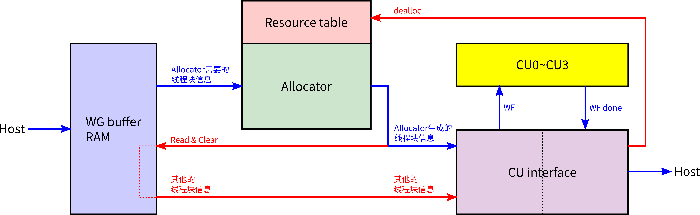
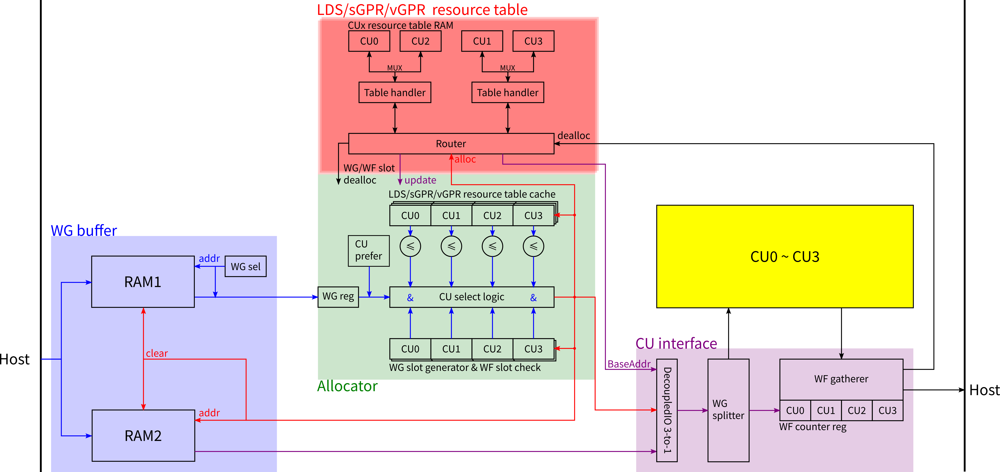

# Top

# 概述

线程块调度器的顶层结构如图，模块之间的蓝色箭头代表主通路

​​

线程块调度器主要分为4大组件，其最基本功能如下：

1. WG buffer

    * 缓存Host发来的线程块
    * 从缓存起来的线程块中挑选一个，发送到allocator
    * 接收Allocator返回的判定结果，若线程块被接受需读取WG RAM2中的信息发送给CU interface
2. Allocator

    * 从WG buffer接收待判定的线程块相关信息
    * 对线程块做如下两项处理（核心功能）

      * 决定对这个线程块来说各CU的优先级
      * 检验各CU剩余资源能否容纳此线程块（依据RTcache中缓存的空闲资源片段大小）
      * （这两条操作相互独立，可以并行或任意先后顺序）
    * 综合上述两条处理的结果，得出判定结论

      * 若所有CU均不能容纳此线程块，丢弃其信息，重新开始
      * 若至少一个CU能容纳此线程块，从中挑选优先级最高的CU
    * 向Resouce table发送alloc请求，等待生成各资源的Base Address
    * 向WG buffer发送分配结果（拒绝/接受），请求读取WG Ram2中的线程块信息
    * 将成功分配的线程块传递给CU interface
3. Resource table

    * 利用链表记录运行中的WG占用资源片段的Base Address与Size
    * 接收到alloc或dealloc请求时更新链表
    * 对alloc请求，扫描链表，寻找一个合适的Base Address
    * alloc/dealloc结束后扫描链表，找到最大的几个空闲资源片段，将其大小汇报给allocator
4. CU interface

    * 从allocator接收线程块，记录其线程束数量
    * 将线程块拆分为线程束，逐个发送给目标CU
    * 从各CU接收执行完毕的线程束，找到对应的线程块记录，将剩余线程束数量减1
    * 若某一线程块记录的线程束数量变为0，说明此线程块执行完毕，通知Resouce table释放资源，并汇报给Host

# 优化目标

最关心的是GPU整体的吞吐率，也就是最右侧向Host回报线程块已完成的吞吐率

全路径中的吞吐率瓶颈应当在CU，而不在线程块调度器

线程块调度器的主要优化目标是通过调度策略简介提高CU吞吐率，而线程块调度器自身的吞吐率并不关键

# 细化

1. CTA调度器总共需要处理5类资源，其中LDS/sGPR/vGPR处理逻辑在Resource table中实现，WG/WF slot处理逻辑简单因而平铺到Allocator中

    |资源种类|给定用量|判定容纳|生成基址|存储方式|处理方式|
    | ----------| ----------| ----------| ----------| ----------| ------------|
    |LDS|✓ |✓|✓|链表|遍历|
    |sGPR|✓|✓|✓|链表|遍历|
    |vGPR|✓|✓|✓|链表|遍历|
    |WG slot|const 1|✓|✓|Bool数组|优先级编码|
    |WF slot|✓|✓||计数器|比较|

    > 关于WG slot：这是一种在CTA调度器中使用的资源，它是：
    >
    > 1. Resource table链表底层的一维RAM的一个位置，因此一个CU的链表最多存储NUM_WG_SLOT个线程块
    > 2. CU interface中用于记录线程块已完成WF数量的WF counter reg，以及记录此线程块WF总数量的reg
    >
2. WG/WF slot也需要dealloc，但WG slot的dealloc不能早于LDS/sGPR/vGPR的dealloc，因为链表项是存储在WG slot上的，必须先解除占用再dealloc  
    或者两者在同一周期开始也可以，因为RT dealloc删除链表项的操作是原子的  
    本实现中WG/WF slot会经过resource table转发以确保WG slot的dealloc时机正确
3. 线程块可以不消耗某类资源，则此线程块不会写入到这种资源的链表中  
    Allocator也会生成三种delloc_en信号，告知此线程块最终需要从哪些链表中dealloc

​​
