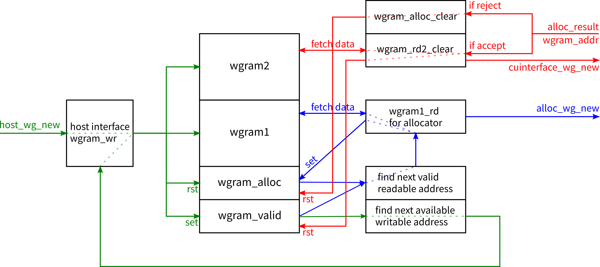

# wg_buffer

wg_buffer整体架构如下图所示，图中黑色框内的半透明虚线代表组合逻辑路径

模块DecoupledIO中所有valid与bits信号均为reg输出，而ready信号可能是组合逻辑输出。若需要ready也为reg输出，后续可添加skid buffer。

​​

本模块中各部分的作用：

* wgram1记录allocator会用到的wg信息，其读端口是0周期延时的组合逻辑输出
* wgram2记录其他host发来的wg信息，仅在allocator accept wg时读取并发送到CU interface，其读端口是0周期延时的组合逻辑输出
* wgram_valid记录每个address上的wgram记录项是否有效
* wgram_alloc记录每个address上的wgram记录项是否即将或已经被发送到allocator，用于防止同一个wg被重复发送。若不使用，同一时刻allocator中同一个wg可能存在多个副本，导致同一wg被accept多次
* 代码中`wgram_wr_next`​用于寻找下一个可写的空RAM位，采用轮询优先级的优先级编码器RRPriorityEncoder
* 代码中`wgram1_rd_next`​用于寻找下一个可读的RAM项（`valid && !alloc`​），采用轮询优先级的优先级编码器RRPriorityEncoder

本模块在每个周期的操作可分为三部分，由于valid与alloc实现的锁机制，三个功能访问的RAM项必定是不同的，三个功能的运行相互独立

1. 依据wgram_valid中的记录寻找一个可写的空RAM位，若此时host发来新wg则将信息写入wgram
2. 依据wgram_valid与wgram_alloc中的记录需找一个可以发送到allocator的wg记录，将其内容从wgram1中读到reg中准备发送到allocator，同时将wgram_alloc中的对应位置一
3. 收到alloctor发回的判定结果：

    * 若线程块分配请求被accept，则依据附带发回的wgram_addr将剩余信息从wg_ram2中读到reg中准备发送到CUinterface，同时将wgram_valid中的对应位清零
    * 若线程块分配请求被reject，则依据附带发回的wgram_addr将wgram_alloc中的对应位清零，允许此wg以后再被发送到allocator

进一步改进：

* 图中`wgram1_rd for allocator`​与`wgram_rd2_clear`​两个模块中驱动输出DecoupledIO的逻辑部分可以改用skid_buffer_valid
* 蓝色部分的组合逻辑链路可能过长，也许可以对`find next valid readable address`​的输出结果打一拍（增加一流水级）
* 优化选择wgram1中的wg并发送到allocator的选择算法
