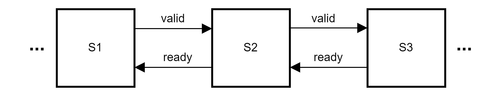

# Utilities

# log2Ceil

关于Chisel提供的log2Ceil函数：Compute the log2 of a Scala integer, rounded up

* Useful for getting the number of bits needed to represent some number of states (in - 1)
* To get the number of bits needed to represent some number n, use log2Ceil(n + 1).
* Example:

  ```
  log2Ceil(1)  // returns 0
  log2Ceil(2)  // returns 1
  log2Ceil(3)  // returns 2
  log2Ceil(4)  // returns 2
  ```

例如，假定某种硬件资源共有X个：

* 单次资源占用量取值范围$[0,X]$，需要使用`log2Ceil(X+1)`​
* 资源地址取值范围$[0,X-1]$，需要使用`log2Ceil(X)`​

# sort3

一种特化的用于3个UInt数据排序的组合逻辑电路

假定三个输入分别为a, b, c，首先构建如下布尔值阵列：

||res(i)(0)|res(i)(1)|备注|
| -------------| :---------: | :---------: | -----------------------------------------------------|
|关于a的比较|$a>b$|$a \ge c$|第二列可由第一列取反得到|
|关于b的比较|$b>c$|$b\ge a$||
|关于c的比较|$c>a$|$c\ge b$||

分配讨论：

1. 若三个输入互不相等，则三行比较结果必定为：最大者`11`​，中值者`10`​，最小者`00`​
2. 若有一者最大，其他两者相等，则三行比较结果必定为：最大者`11`​，其他两者中有一为`01`​，另一为`00`​
3. 若有一者最小，其他两者相等，则三行比较结果必定为：最小者`00`​，其他两者中有一为`01`​，另一为`11`​
4. 若三者全部相等，则三行比较结果均为`01`​

观察发现：

1. 三者不全部相等 $\iff$ 第一列不全部为0，此时：

    * 有且仅有1行`andR == true`​，此行的对应数据可作为最大值输出
    * 有且仅有1行`xorR == true`​，此行的对应数据可作为中间值输出
    * 有且仅有1行`orR == false`​，此行的对应数据可作为最小值输出
2. 三者全部相等 $\iff$ 第一列全部为0，此时：

    * 三行的`andR`​全部为`false`​
    * 三行的`xorR`​全部为`true`​
    * 三行的`orR`​全部为`true`​

因此，排序结果可输出为：

```scala
largest := Mux1H(Seq(
  // 三输入不全部相等时前三个条件有且仅有1个为真
  res(0).asUInt.andR -> io.in(0),
  res(1).asUInt.andR -> io.in(1),
  res(2).asUInt.andR -> io.in(2),
  // 三输入全部相等时有且仅有最后一个为真
  !(res(0)(0) || res(1)(0) || res(2)(0)) -> io.in(0),
))
```

```scala
middle := Mux1H(Seq(
  // 三输入不全部相等时，三个条件有且仅有1个为真
  // 三输入全部相等时，三个条件全真
  // 这里假定三个条件全真时，输出：in(0)|in(1)|in(2)
  // 否则需要额外增加一层Mux
  res(0).asUInt.xorR -> io.in(0),
  res(1).asUInt.xorR -> io.in(1),
  res(2).asUInt.xorR -> io.in(2),
))
```

```scala
smallest := Mux1H(Seq(
  // 三输入不全部相等时前三个条件有且仅有1个为真
  !res(0).asUInt.orR -> io.in(0),
  !res(1).asUInt.orR -> io.in(1),
  !res(2).asUInt.orR -> io.in(2),
  // 三输入全部相等时有且仅有最后一个为真
  !(res(0)(0) || res(1)(0) || res(2)(0)) -> io.in(0),
))
```

# RRPriorityEncoder

采用轮询优先级的优先级编码器，是一个循环右移与固定优先级编码器的级联，以5bit宽度为例：

|输入|**上**次的有效Enco**de输出（last）**|**循环右移shift=last+1**|**低位优先编码器输出encode**|**本次RR优先级编码结果encode+shift**|
| -------------------| ------------------| -----------------------------------------| ---| ----------------|
|in[4:0]<br />5'b10101|1（对应in[1]）|shift = 2<br />{in[1:0], in[4:2]}<br />5'b01101|0|2（对应in[2]）|
|in[4:0]<br />5'b10101|2（对应in[2]）​|shift = 3<br />{in[2:0], in[4:3]}<br />5'b10110|1|4|
|in[4:0]<br />5'b10101|4|shift = 5<br />in[4:0]<br />5'b10101|0|5 -> 0​|

‍

# skid buffer：用于valid-ready接口打拍

下面研究如何给一个valid-ready接口打拍，也就是断开两已有模块间的valid-ready，插入skid buffer


简易的方法是使用一个同步FIFO解决（注意FIFO的特性：未满时允许输入，非空时允许输出）

1. FIFO depth = 1：这种FIFO要么满要么空，无法同时输入输出。引入：1拍数据延迟、吞吐量减半、1个dataReg硬件开销
2. FIFO depth ≥ 2：引入1拍数据延迟，吞吐量不变、至少2个dataReg硬件开销

## 仅打拍valid-data（Forward Register Slice）

这种情况下插入的buffer实质上可以视为valid-ready流水线中的一级，在时序允许的情况下对data附加单周期运算不会造成任何影响

无其他控制逻辑时为了保证valid-ready接口可连续传输的特性，必须使`in_ready`​是组合逻辑输出

```scala
val data = RegEnable(io.in.bits, io.in.fire)  // 输入接口成功交互的数据存入dataReg

val dataValid = RegInit(false.B)           // 初始状态dataReg无有效数据
dataValid := Mux(io.in.fire,  true.B,      // 有新数据输入，dataValid必定变为真
             Mux(io.out.fire, false.B,     // 无新数据输入且有数据输出，dataValid变为假
                              dataValid))  // 既无输入又无输出，dataValid维持不变
                            
// dataValid也可以用如下等效逻辑驱动
dataValid := Mux(io.in.valid, true.B,      // 上游输入有效 => 下周期dataReg不可能空
             Mux(io.out.ready, false.B,    // 无有效输入 && 输出端可以接收 => 下周期dataReg空
                               dataValid)) // 上下游都拒绝交互，本模块将维持原状
dataValid := io.in.valid || (!io.out.ready && dataValid) // 等效

io.in.ready := ~dataValid || io.out.ready  // dataReg空或下游即将取走数据时，允许接收新数据
io.out.valid := dataValid
io.out.bits := data
```



> 可以使原有`io.in.valid`​与外部控制信号`ext_ctrl`​做组合逻辑运算形成新的`io.in.valid`​，从而允许外部控制新数据的输入时机

> 代价：1周期数据延时（对data打拍的必然结果）、吞吐量不变、1个dataReg硬件开销

多级串联成流水线时，各ready信号将反向级联成组合逻辑链路，往往成为这类流水线的时序关键路径。

## 仅打拍ready（Backward Register Slice）

直接给ready信号打一拍将导致：

1. ready下降沿处丢失一个数据包
2. ready上升沿处的数据包被重复传输两次

如果只是为了断开ready组合逻辑链路，更好的办法是采用skid buffer，它无数据延迟、吞吐量不变、只有1个dataReg硬件开销

1. 在后级持续ready时它是透明的，两端的valid-ready端口直接连接。此状态下dataReg中无有效数据
2. 后级ready下降沿时，使本会丢失的数据包缓存进dataReg中，并将后级的valid-ready接口连接到dataReg上
3. 后级ready上升沿时，将先从dataReg中接收原先错失的数据包，之后重新使两端的valid-ready接口直接连接，恢复正常传输状态

```scala
val in_ready = RegInit(true.B)          // 初始状态skidReg空，至少可接收一个数据
val skid = io.in.fire && !io.out.ready  // 输入端接收到新数据 && 输出端拒绝接收新数据 => skid
val data = RegEnable(io.in.bits, skid)  // 输入数据进入skidReg
in_ready := io.out.ready ||                            // 输出端可以接收数据 => 下周期skidReg必空
                            (!io.in.valid && in_ready) // 输入端无新数据 => skidReg可以维持原有空状态

io.in.ready := in_ready         // 为保证io.in.ready是reg输出才使用dataValid的反信号
io.out.valid := !in_ready || io.in.valid
io.out.bits := Mux(!in_ready, data, io.in.bits)
```

## 打拍全部valid-data-ready（Full Register Slice）

将上述两种电路级联可以完成要求，但一般来说会重新设计

打拍valid-data-ready三种信号的skid buffer可以视为一种特化的depth=2的FIFO

[这篇文章](http://fpgacpu.ca/fpga/Pipeline_Skid_Buffer.html)中给出了一种状态机实现的Full register slice，其状态迁移图如右所示

‍

```text
// 状态转移图
                 /--\ +- flow
                 |  |
          load   |  v   fill                          // +： new data got from input
 -------   +    ------   +    ------        (CBM)     // -:  data removed to output
|       | ---> |      | ---> |      | ---\ +  dump    //+-:  in & out simultaneously
| Empty |      | Busy |      | Full |    |   or
|       | <--- |      | <--- |      | <--/ +- pass
 -------    -   ------    -   ------
         unload         flush
```

## chisel中的skid buffer

chisel提供的Queue的构建参数`flow`​与`pipe`​的功能似乎可以将其行为调整为与skid buffer相同

1. ​`entries=1, pipe=true, flow=false`​时的行为应当与只打拍valid, data信号的skid buffer相同
2. ​`entries=1, pipe=false, flow=true`​时的行为应当与只打拍ready信号的skid buffer相同
3. ​`entries=2`​时的行为应当与打拍全部valid, data, ready信号的skid buffer相同
